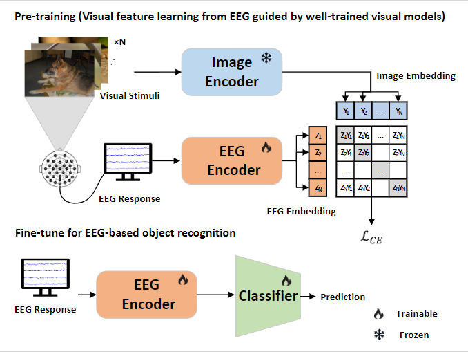

# GVFL
### GVFL-EEG: Guided Visual Feature Learning from Randomized EEG Trials for Object Recognition

##### Core idea: basic constrastive learning for image and EEG. Interesting analysis from neuroscience perspective! 🤣

## Abstract

- We introduce GVFL-EEG, a novel two-stage learning
framework designed for decoding visual object cate-
gories from randomized EEG trials. This framework uti-
lizes a pre-trained image encoder to guide the training of
an EEG encoder, enabling effective extraction of visual
representations from EEG signals.
- We develop EEGMambaformer, an EEG encoder incor-
porating a residual Mamba block to capture the temporal
dynamics of EEG signals. This is further enhanced by an
inverted transformer encoder that applies self-attention
across EEG channels to elucidate spatial dependencies
inherent in the EEG data.
- Our experimental results demonstrate that the proposed
framework successfully extracts visual representations of
perceived objects from EEG responses, achieving state-
of-the-art performance for object recognition using ran-
domized EEG trials.
- We conduct extensive experiments to investigate how dif-
ferent oscillation rhythms and time ranges affect decod-
ing performance, thereby enhancing our understanding
of the neural encoding of visual information.

## Datasets
many thanks for sharing good datasets!
[EEG40000](https://ieee-dataport.org/open-access/dataset-object-classification-randomized-eeg-trials)

### Data pre-processing Steps
1. pre-processing path
   - `.data_preprocess/bin_self/`
   - modify `preprocessing.m` as you need.
     - choose time range,downsample rate and other parameters.
2. pre-processing EEG data 
     - Re-referencing
     - Signal filtering
     - channel selection
     - Time window selection
     - baseline correction
     - downsampling
     - Normalization
     - Save the preprocessed data

3. load preprocessed data and extract img features
   - `.data_preprocess/bin/vit_img.py`
   - modify `vit_img.py` as you need.
   - extract image features using ViT model.

## Prepare Environment
~~~
pip install -r requirements.txt
~~~

### Run the Code
Modify `gvfl_classification\config.json` as you need.
Use the following command to start the program:
for pretrain:
  - `.gvfl_classification\GVFL_pretrain.py`
for finetune classification:
  - `.gvfl_classification\GVFL_classification.py`

## Citation
Hope this code is helpful. I would appreciate you citing us in your paper. 😊

<!-- ## Acknowledgement

## References

## License -->